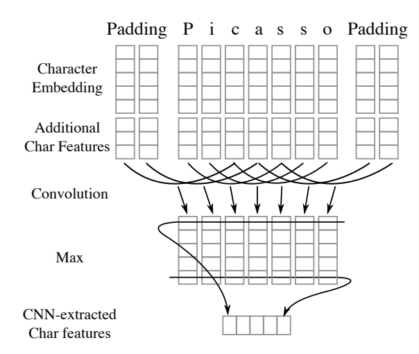

Named entity recognition is the task of tagging each token in a string of text with one of many labels.  This can consists of names, organizations, locations, expressions of times, quantities, monetary values, percentages, etc.  Google assistant, Siri and Amazon Alexa all employ some form of named entity recognition, in order to respond intelligently to the user.

Building deep learning models for this task can be challenging for the following reasons:

- The dataset labels are predominantly "not entity".  If a more traditional loss function is used, such as the cross entropy loss, the model can achieve over 90% accuracy by simply predicting "not entity".  To combat this a custom loss function is often used instead, to encourage the model to find entities.

- The model input is a string of text, which varies in length. The model output is an annotated tag sequence, which also varies in length.

- Often extensive feature generation is required, such as generating pos tags, dependency parsing, shape features etc.

This blog post was inspired by Jason P.C. Chiu and Eric Nichols research paper: [Named Entity Recognition with Bidirectional LSTM-CNNs](https://www.aclweb.org/anthology/Q16-1026).  Their proposed model established state of the art performance on both the CONLL-2003 and OntoNotes 5.0 public datasets.

## BILOU tagging

Entities can consist of more than one token.  For this reason the BILOU tagging sequence is used.  This stands for beginning, inside, last, outside and unit tags. 

For example, the tokenized sentence `['I', 'want', 'to', 'work', 'for', 'Elon', 'Reeve', 'Musk', 'and', 'Google']` would be labelled as `['O', 'O', 'O', 'O', 'O', 'B-person', 'I-person', 'L-person', 'O', 'U-company']`.

## Input

The model input is a sequence of tokens.  Feature engineering during preprocessing extracts characters from each token and includes POS tags:

## Output

The output from the model is a BILOU tag sequence, indicating the tag for each token in the input sequence.

## Performance Metrics

The following metrics were used to monitor the model performance during training:

*Precision:* of the times the model predicts a token is an entity, what percentage were correct predictions?

*Recall:* of the tokens that were entities, what percentage did the model correctly predict?

*F1 score:* harmonic mean of precision and recall

A high F1 score is the name of the game here.

## Architecture

Below we see the model architecture.  First an array of characters for the input sequence is passed to the convolutional component.  Each character is embedded.  A kernel slides over the word, one character at a time.  The output from each kernel is pooled to a single feature value. The resulting features are then appended to the word embedding, along with any other included features such as poss tags.

> Image from [Named Entity Recognition with Bidirectional LSTM-CNNs](https://www.aclweb.org/anthology/Q16-1026), Figure 1

> Image from [Named Entity Recognition with Bidirectional LSTM-CNNs](https://www.aclweb.org/anthology/Q16-1026), Figure 2

Word embeddings + features are passed through a bidirectional lstm lyaer, each recurrent output is mapped to the number of possible tags before the log softmax function is applied.  The result is a model that predicts the probability of all possible tags for each token in the input sequence.

## Instructions

1. download and unzip the dataset:
2. set up config
3. run preprocessing
4. run training

## What I didn't do

1. additional word features
2. padding of char features before cnn component
3. cnn component hyperparams
3. softmax + weighted cross entropy loss vs log softmax plus sentence level log likelihood plus possible tag sequences
4. pretrained word embeddings
5. Adam optimizer
6. trained on kaggle NER dataset instead, to performance = 89%F1 score on entity class

# Notes

1) explain task
2) explain how entities are often annotated and metrics are defined
3) explain techniques
4) explain model
5) explain code
6) explain results

- Used hyperparams from CoNLL-2003 (Round 2) NER model, excluding a few differences
- 